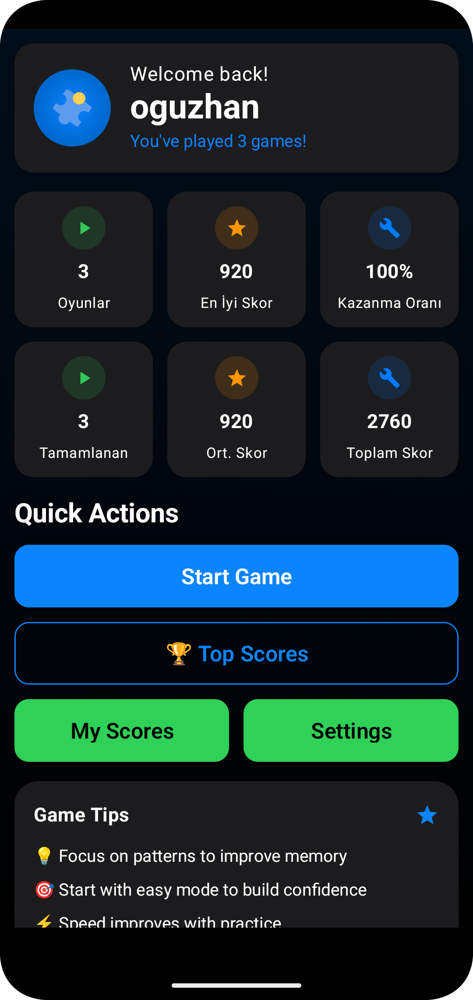
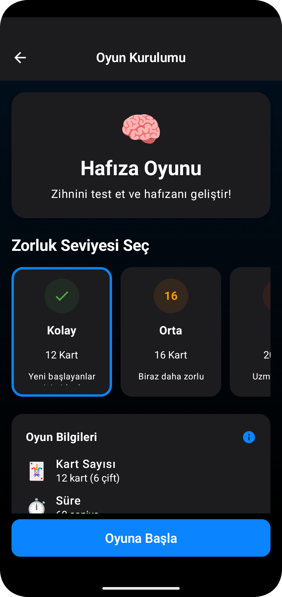
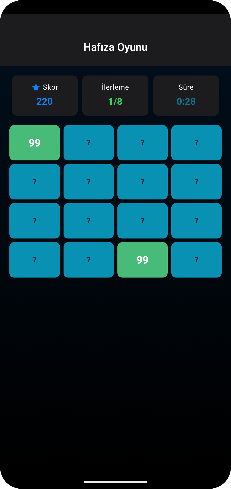
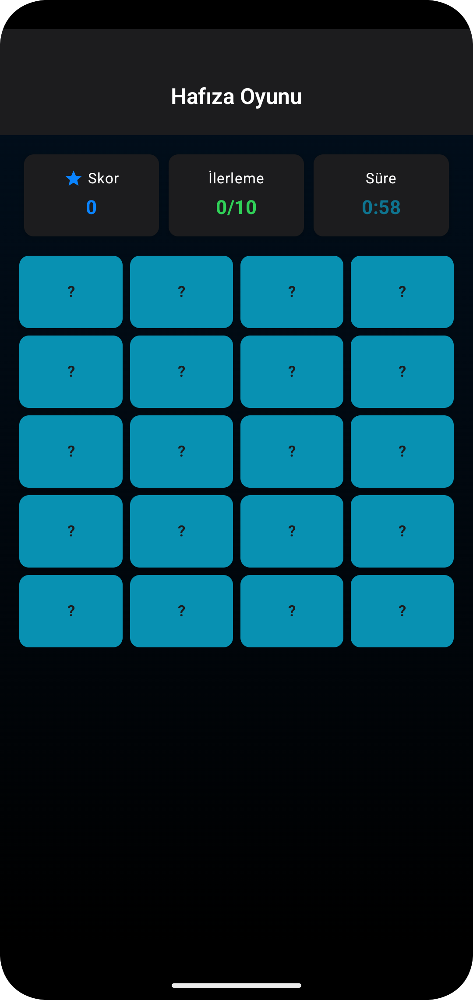
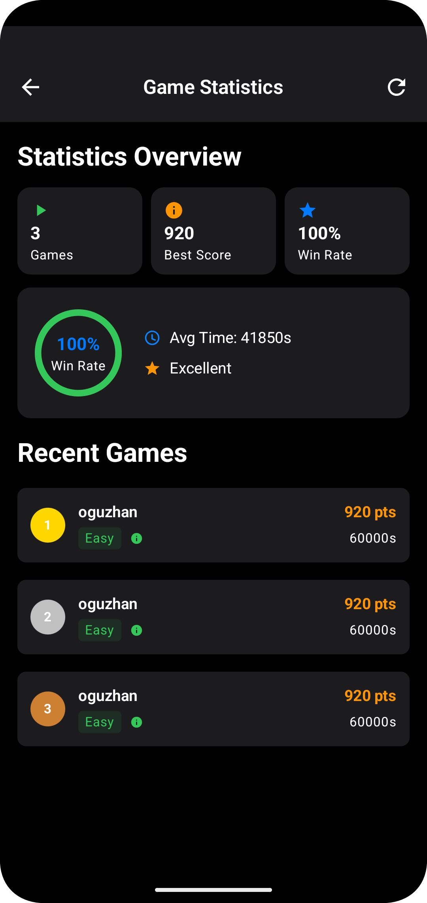
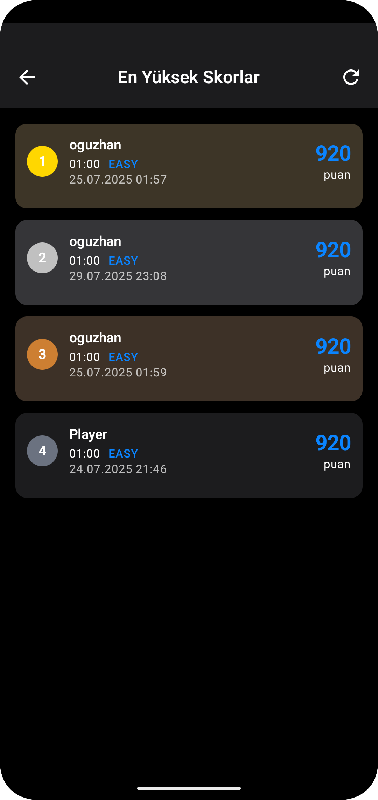
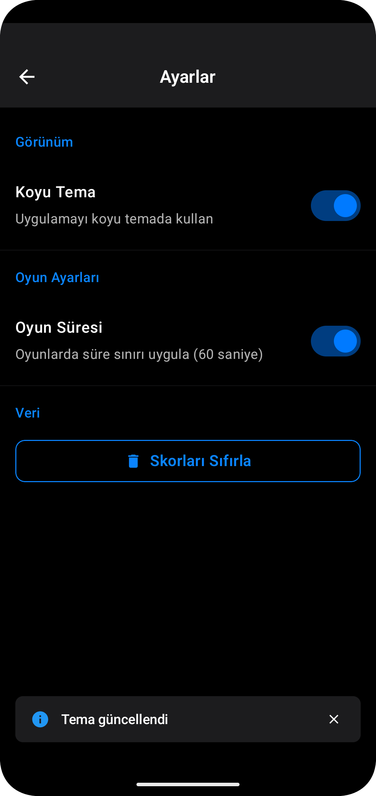

# 🎮 Memory Game - Android Bootcamp Final Project

Modern Android uygulaması olarak geliştirilmiş hafıza oyunu. Jetpack Compose kullanılarak Clean
Architecture prensiplerine uygun şekilde tasarlanmıştır.

## 📱 Uygulama Hakkında

Memory Game, kullanıcıların hafıza becerilerini test edebileceği eğlenceli bir kart eşleştirme
oyunudur. Farklı zorluk seviyeleri, skor takibi ve kişiselleştirilebilir ayarlar ile zengin bir oyun
deneyimi sunar.

## ✨ Özellikler

### 🎯 Oyun Özellikleri

- **Çoklu Zorluk Seviyesi**: Kolay (4x3), Orta (4x4), Zor (6x4)
- **Zamanlı Oyun**: İsteğe bağlı süre sınırı
- **Skor Sistemi**: Performans bazlı puanlama
- **Skor Takibi**: Kişisel ve genel en yüksek skorlar

### 🔧 Uygulama Özellikleri

- **Firebase Authentication**: Güvenli kullanıcı girişi
- **Cloud Firestore**: Gerçek zamanlı veri senkronizasyonu
- **Tema Desteği**: Açık/Koyu tema seçenekleri
- **Çevrimdışı Desteği**: DataStore ile yerel veri saklama
- **Modern UI**: Material 3 Design System

## 🚀 Kullanılan Teknolojiler

### 🏗️ Mimari & Pattern

- **Clean Architecture**: Katmanlı mimari yapısı
- **MVVM Pattern**: UI state yönetimi
- **MVI Pattern**: Unidirectional data flow
- **Repository Pattern**: Veri katmanı soyutlaması

### 🛠️ Geliştirme Araçları

- **Kotlin** (2.1.21) - Ana programlama dili
- **Jetpack Compose** - Modern UI toolkit
- **Material 3** - UI design system
- **Coroutines & Flow** - Asenkron programlama

### 🔌 Kütüphaneler

- **Hilt** (2.55) - Dependency injection
- **Navigation Compose** (2.9.0) - Navigasyon
- **Firebase BOM** (33.15.0)
    - Authentication - Kullanıcı doğrulama
    - Firestore - NoSQL veritabanı
    - Realtime Database - Gerçek zamanlı veri
- **DataStore** (1.1.1) - Yerel veri saklama
- **Coil** (2.7.0) - Image loading
- **Kotlinx Serialization** (1.8.1) - JSON serialization

### 🔍 Kalite Araçları

- **Detekt** - Static code analysis
- **KSP** - Annotation processing

## 📸 Ekran Görüntüleri

### 🏠 Ana Ekran & 🎮 Oyun Kurulumu

<table>
  <tr>
    <td align="center">
      
      <br>
      <strong>Ana Ekran</strong>
      <br>
      Kullanıcı istatistikleri ve navigasyon
    </td>
    <td align="center">
      
      <br>
      <strong>Oyun Kurulumu</strong>
      <br>
      Zorluk seviyesi ve ayarlar
    </td>
  </tr>
</table>

### 🃏 Oyun Deneyimi

<table>
  <tr>
    <td align="center">
      
      <br>
      <strong>Kolay Seviye (4x3)</strong>
      <br>
      Yeni başlayanlar için ideal
    </td>
    <td align="center">
      
      <br>
      <strong>Orta Seviye (4x4)</strong>
      <br>
      Dengeli zorluk seviyesi
    </td>
  </tr>
</table>

### 🎯 Skor Takibi

<table>
  <tr>
    <td align="center">
      
      <br>
      <strong>Kişisel Skorlar</strong>
      <br>
      Kendi performansınızı takip edin
    </td>
    <td align="center">
      
      <br>
      <strong>Global Liderlik</strong>
      <br>
      Tüm oyuncular arasında sıralama
    </td>
  </tr>
</table>

### ⚙️ Kişiselleştirme

<table>
  <tr>
    <td align="center">
      
      <br>
      <strong>Ayarlar</strong>
      <br>
      Tema, oyun ayarları ve veri yönetimi
    </td>
    <td align="center">
      <br>
      <strong>🌙 Koyu Tema Desteği</strong>
      <br>
      Gözlerinizi koruyun
    </td>
  </tr>
</table>

## 🏃‍♂️ Kurulum ve Çalıştırma

### Ön Gereksinimler

- Android Studio Giraffe (2023.2.1) veya üzeri
- JDK 17
- Android SDK (Min API 27, Target API 35)
- Firebase projesi

### Adımlar

1. **Projeyi klonlayın**
   ```bash
   git clone https://github.com/yourusername/AndroidBootcampFinalProject.git
   cd AndroidBootcampFinalProject
   ```

2. **Firebase Kurulumu**
    - Firebase Console'da yeni proje oluşturun
    - Android uygulamasını ekleyin (package name: `com.oguzhanozgokce.androidbootcampfinalproject`)
    - `google-services.json` dosyasını `app/` klasörüne ekleyin
    - Authentication, Firestore ve Realtime Database'i etkinleştirin

3. **Bağımlılıkları yükleyin**
   ```bash
   ./gradlew build
   ```

4. **Uygulamayı çalıştırın**
   ```bash
   ./gradlew installDebug
   ```

## 🏗️ Proje Yapısı

```
app/src/main/java/com/oguzhanozgokce/androidbootcampfinalproject/
├── common/           # Ortak utility'ler ve extension'lar
├── data/            # Veri katmanı (Repository implementations, DataStore)
│   ├── mapper/      # Data-Domain model dönüşümleri
│   ├── model/       # Data model'ları
│   └── repository/  # Repository implementasyonları
├── delegation/      # MVI delegation pattern
├── di/              # Dependency Injection modülleri
├── domain/          # İş mantığı katmanı
│   ├── model/       # Domain model'ları
│   ├── repository/  # Repository interface'leri
│   └── usecase/     # Use case'ler
├── navigation/      # Navigation graph
└── ui/              # Presentation katmanı
    ├── auth/        # Authentication ekranları
    ├── components/  # Reusable UI bileşenleri
    ├── game/        # Oyun ekranları
    ├── home/        # Ana ekran
    ├── settings/    # Ayarlar ekranı
    ├── theme/       # UI tema ve renkler
    └── topscores/   # Skor ekranları
```

## 🎯 Öne Çıkan Özellikler

### 🔧 Teknik Özellikler

- **Clean Architecture**: Temiz, sürdürülebilir kod yapısı
- **Reactive Programming**: Flow ve Coroutines ile reactive yaklaşım
- **Type Safety**: Kotlinx Serialization ile tip güvenli JSON işleme
- **Modern UI**: Jetpack Compose ile declarative UI
- **Dependency Injection**: Hilt ile modüler yapı

### 🎮 Oyun Mekaniği

- **Akıllı Skor Sistemi**: Süre, hamle sayısı ve zorluk bazlı puanlama
- **Adaptive UI**: Farklı zorluk seviyelerine göre dinamik grid yapısı
- **Real-time Updates**: Firebase ile gerçek zamanlı skor güncellemeleri
- **Offline Support**: Bağlantı olmadan da oynanabilir

## 🤝 Katkıda Bulunma

1. Fork edin
2. Feature branch oluşturun (`git checkout -b feature/amazing-feature`)
3. Değişikliklerinizi commit edin (`git commit -m 'Add amazing feature'`)
4. Branch'inizi push edin (`git push origin feature/amazing-feature`)
5. Pull Request oluşturun

## 📄 Lisans

Bu proje MIT lisansı altında lisanslanmıştır. Detaylar için [LICENSE](LICENSE) dosyasına bakın.

## 👨‍💻 Geliştirici

**Oğuzhan Özgökçe**

- GitHub: [@oguzhanozgokce](https://github.com/oguzhanozgokce)

---

**📱 Android Bootcamp Final Project - 2025**